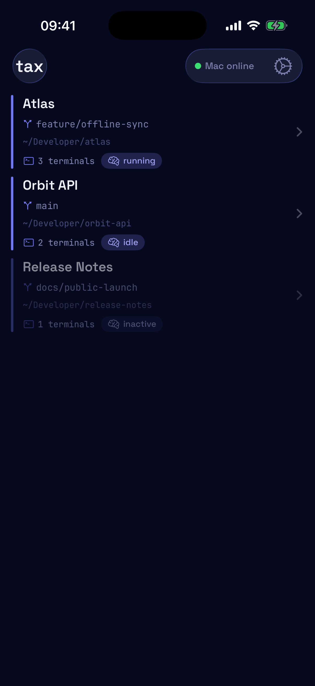
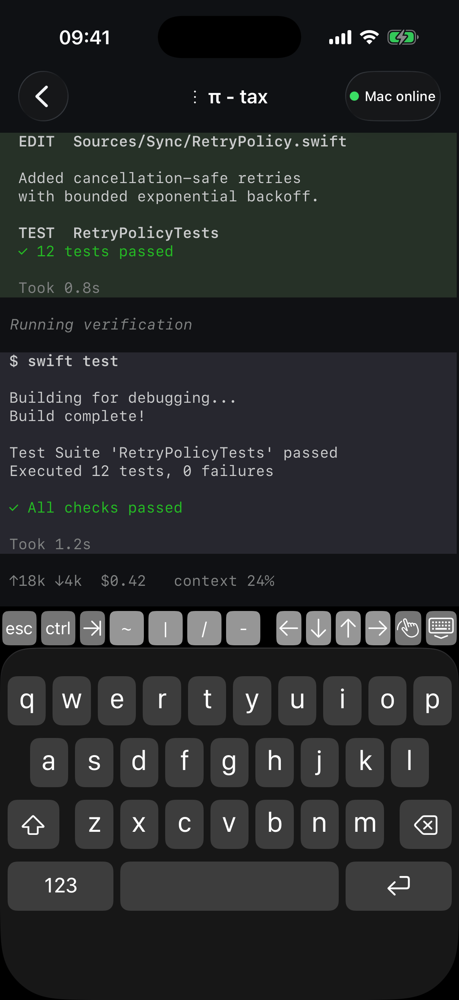
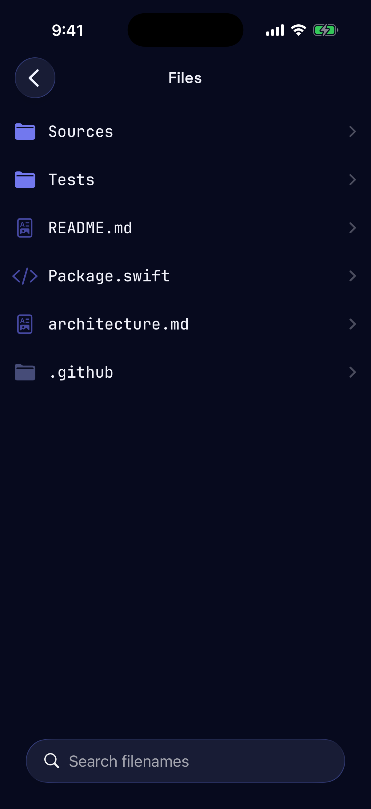
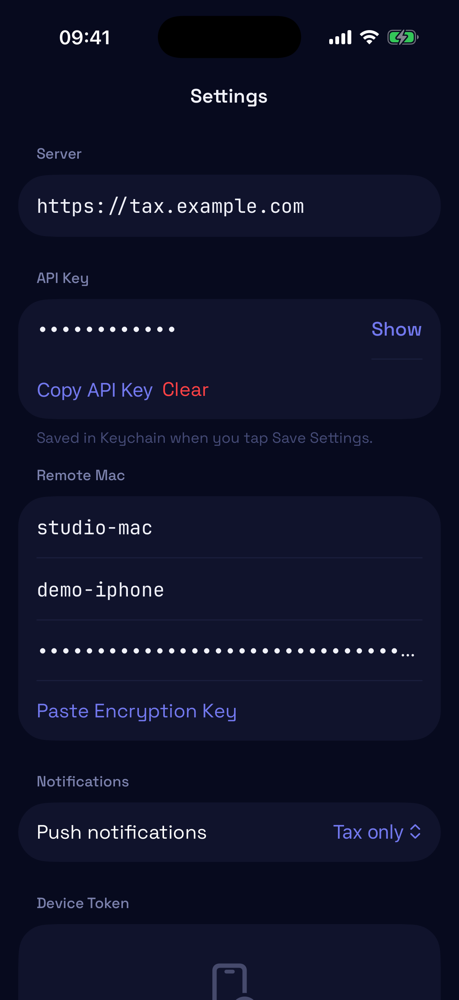

# tax (Task Agent eXchange) — remote Orca workspace for iPhone

`tax` позволяет с iPhone подключаться к открытым workspace и терминалам Orca на Mac через зашифрованный relay. Приложение показывает ANSI/TUI-вывод, отправляет ввод в выбранный PTY, создаёт и закрывает терминалы, запускает консольных агентов (pi, Claude Code, Codex) и любые CLI-программы, а также позволяет безопасно просматривать и редактировать файлы workspace.

## Screenshots

<table>
  <tr>
    <td align="center"><br><sub>Remote workspaces</sub></td>
    <td align="center"><br><sub>Agent terminal</sub></td>
  </tr>
  <tr>
    <td align="center"><br><sub>Workspace files</sub></td>
    <td align="center"><br><sub>Self-hosted settings</sub></td>
  </tr>
</table>

All screenshots use deterministic demo data. No live server, credentials, device tokens, workspace paths, or terminal sessions are included.

## Архитектура

- **Orca Runtime на Mac** — источник workspace и терминалов;
- **tax remote host на Mac** — адаптер к приватному протоколу Orca и scoped file service;
- **backend/VPS** — маршрутизирует только ciphertext и отправляет APNs;
- **iOS-приложение** — SwiftUI-клиент со SwiftTerm 1.20.0 как единственным bundled terminal renderer’ом;
- **E2EE** — отдельный 256-битный ключ tax, которого нет на backend.

Terminal renderer подключён через независимый tax-owned contract: readiness с viewport, изменения viewport, binary input, reset/application snapshot, incremental bytes и focus. Сейчас этот contract реализует только SwiftTerm; будущий libghostty adapter должен реализовать тот же contract и не менять `RemoteWorkspaceStore`, remote protocol или Mac host.

Backend не хранит terminal input/output или содержимое файлов. Неопределённо доставленный ввод автоматически не повторяется.

## Что понадобится

- запущенная Orca на Mac;
- установленный `tax` CLI (`./scripts/install.sh`);
- актуальный backend;
- iPhone с установленным приложением `tax`;
- четыре совпадающих значения:
  - backend API key;
  - tax E2EE key;
  - Host ID, обычно `mac-main`;
  - Device ID, обычно `iphone-main`.

API key, E2EE key и Orca pairing code — секреты. Не добавляйте их в Git, сообщения, скриншоты или логи.

## Как получить ключи

### 1. Backend API key

На VPS из-под `root`:

```bash
cd /home/hermes/tax
grep -m1 '^TAX_API_KEY=' server/.env | cut -d= -f2-
```

Скопируйте значение после `TAX_API_KEY=` напрямую в настройки iPhone и в конфигурацию Mac. Не публикуйте вывод команды.

На Mac настройте CLI без сохранения ключа в истории shell:

```bash
read -s 'TAX_KEY?Backend API key: '; echo
tax config \
  --server https://tax.138-249-127-23.nip.io \
  --api-key "$TAX_KEY"
unset TAX_KEY
```

### 2. Tax E2EE key

На Mac сгенерируйте отдельный ключ:

```bash
tax e2ee-key generate
```

Он сохраняется в macOS Keychain под service `tax.remote.e2ee`. Чтобы повторно показать и сразу скопировать его в clipboard:

```bash
tax e2ee-key show | pbcopy
```

Вставьте это значение в поле **256-bit encryption key** на iPhone. Backend этот ключ не получает.

### 3. Orca pairing code для Mac host

1. Откройте Orca на Mac.
2. Откройте **Settings → Runtime Environments**.
3. В секции **Share this Orca server** нажмите **New Link**.
4. Сгенерируйте ссылку и выберите **Copy pairing URL**.
5. Сохраните URL в защищённый файл:

```bash
mkdir -p ~/.config/tax
install -m 600 /dev/null ~/.config/tax/orca-pairing
pbpaste > ~/.config/tax/orca-pairing
chmod 600 ~/.config/tax/orca-pairing
```

Нужен именно runtime pairing URL из **Share this Orca server**. Кнопка копирования в разделе **Orca Mobile** может выдать mobile/relay offer другого формата, который `tax remote-host` не принимает. Pairing URL относится к Orca Runtime и не заменяет tax E2EE key.

## Подключение iPhone

### 1. Настройки приложения

Откройте шестерёнку в приложении и заполните:

| Поле | Значение |
|---|---|
| Server URL | `https://tax.138-249-127-23.nip.io` |
| API Key | значение из `server/.env` |
| Host ID | `mac-main` |
| Device ID | `iphone-main` |
| 256-bit encryption key | результат `tax e2ee-key show` |

Нажмите **Save Settings**, затем **Request Push Registration**. Device token регистрируется на backend автоматически.

### 2. Запуск Mac host в фоне

Установите пользовательский LaunchAgent:

```bash
./scripts/install-remote-host-launch-agent.sh
```

Он запускается после входа в macOS, работает без открытого Terminal и автоматически перезапускает host после обрыва. API key берётся из `tax config`, E2EE key — из Keychain, pairing code — из `~/.config/tax/orca-pairing`.

Проверка и управление:

```bash
launchctl print gui/$UID/tax.remote-host
launchctl kickstart -k gui/$UID/tax.remote-host
tail -f ~/.local/state/tax/logs/remote-host.log
```

Для других идентификаторов:

```bash
./scripts/install-remote-host-launch-agent.sh \
  --host-id mac-main \
  --device-id iphone-main \
  --pairing-code-file ~/.config/tax/orca-pairing
```

Ручной foreground-запуск оставлен для диагностики:

```bash
tax remote-host \
  --host-id mac-main \
  --device-id iphone-main \
  --orca-pairing-code-file ~/.config/tax/orca-pairing
```

Индикатор в левом верхнем углу приложения должен стать зелёным и показать `online`. Mac должен быть включён и не спать, а Orca — запущена.

### 3. Проверка

1. Откройте workspace `main`.
2. Откройте существующий терминал и проверьте ANSI/TUI-вывод.
3. Создайте новый терминал кнопкой `+`.
4. Запустите агента, например `pi` или `claude`, и нажмите `enter`.
5. Проверьте `Ctrl-C`, resize, rename и close.
6. Откройте **Browse workspace files**, текстовый файл, Markdown preview и изображение.

Проверка backend и APNs:

```bash
tax doctor
tax push-doctor
```

Успешный `APNs result: sent` и HTTP `200` означают, что Apple приняла push. Отображение баннера дополнительно зависит от разрешений Notifications, Focus и Scheduled Summary на iPhone.

## Проверка terminal renderer’а

На физическом iPhone, используя живую Orca terminal session, проверьте единственный SwiftTerm renderer:

1. Убедитесь, что initial snapshot появляется целиком, без промежуточных блоков.
2. Создайте большой scrollback и проверьте прокрутку без скачков при новом output.
3. Выполните быстрый input и убедитесь, что он не запаздывает и не дублируется.
4. Откройте клавиатуру и проверьте, что активный prompt остаётся видимым.
5. Запустите TUI-программу, например `pi` или `vim`, в alternate screen и проверьте корректную работу.
6. Выполните reconnect и убедитесь, что экран восстанавливается из нового snapshot без смешивания generations.

## Push deep links

Все интеграции агентов — Pi extension, Claude Code Stop hook и Codex `notify` — отправляют в push только routing identifiers: `host_id`, `workspace_id` и `terminal_id`. Для нестандартного Host ID задайте его в окружении агента:

```bash
export TAX_HOST_ID=mac-main
```

При нажатии push приложение открывает соответствующий Mac, workspace или terminal. Устаревший task/reply UI удалён.

## Завершение команд: `tax run`

`tax run` превращает любую команду в уведомление о завершении. Например, на Mac:

```bash
tax run pytest -q
```

Как это работает:

- команда запускается напрямую, без shell; stdout и stderr объединяются и стримятся в текущий терминал;
- после завершения процесса отправляется ровно один completion push: title строится из имени executable (`pytest completed` либо `pytest failed`), body содержит exit code, `context` — исходную команду, а `logs` — последние 500 строк вывода;
- в metadata уходят `source=tax-cli`, `app=tax`, имя executable в поле `agent`, Host ID из `TAX_HOST_ID` (по умолчанию `mac-main`) и Orca routing-поля `ORCA_TERMINAL_HANDLE`, `ORCA_WORKTREE_ID` (с fallback на `ORCA_WORKSPACE_ID`), `ORCA_TAB_ID`, `ORCA_PANE_KEY`;
- `tax run` возвращает исходный exit code команды; сбой доставки push его не меняет, retries и ожидания ответа нет — уведомление однонаправленное;
- device token хранится на backend: iPhone регистрирует его кнопкой **Request Push Registration**, и если в `tax config` токен не задан, backend использует последнюю регистрацию.

При отсутствии `ORCA_TERMINAL_HANDLE` push по-прежнему отправляется, но на iPhone он откроет только настроенный host без конкретного терминала.

## Claude Code and Codex notifications

TAX can send the same terminal-aware completion notifications for Pi, Claude Code, and Codex. Pi continues to use `extensions/tax-push.ts`; enabling the hooks below does not change or replace the Pi extension.

Before enabling a hook:

1. Install the CLI with `./scripts/install.sh` and confirm that `tax` is available in `PATH`.
2. Configure the backend with `tax config`.
3. Run the agent inside an Orca terminal. TAX intentionally skips the notification when `ORCA_TERMINAL_HANDLE` is unavailable, because the iPhone would not have a terminal to open.

### Claude Code

Merge this `Stop` hook into `~/.claude/settings.json`:

```json
{
  "hooks": {
    "Stop": [
      {
        "hooks": [
          {
            "type": "command",
            "command": "tax notify claude"
          }
        ]
      }
    ]
  }
}
```

Claude Code writes the hook event to standard input. TAX uses only the final assistant message and event metadata; it does not read the transcript file. Claude Code hooks are disabled when Claude is started with `--bare`.

### Codex

Add the following top-level setting to `~/.codex/config.toml`:

```toml
notify = ["tax", "notify", "codex"]
```

Codex appends the `agent-turn-complete` JSON event as the final command-line argument.

Both adapters include the Orca terminal/worktree identifiers from the environment, post to the existing `/push` endpoint, and exit successfully even if notification delivery fails. Duplicate completion events are suppressed locally. To print hook errors during setup, start the agent with `TAX_PUSH_DEBUG=1`.

The push preview contains a shortened final response. The full final response and basic event context are sent to the configured TAX backend, matching the existing Pi notification behavior.

## Backend deploy

С Mac:

```bash
./scripts/deploy-backend.sh
```

Или на VPS из-под `root`:

```bash
git config --global --add safe.directory /home/hermes/tax
cd /home/hermes/tax
git fetch origin main
git pull --ff-only origin main
./deploy.sh
```

Deploy создаёт backup SQLite, обновляет зависимости, перезапускает `tax.service`, проверяет health и schema.

Эксплуатационные инструкции: [`docs/OPERATIONS.md`](docs/OPERATIONS.md).

## Upgrading from versions before 0.4.0

Legacy reply-механика удалена: CLI больше не запускает фонового агента и не ждёт ответа с iPhone. При обновлении через `./scripts/install.sh`:

- установщик снимает только LaunchAgent `tax.agent` (`gui/$UID/tax.agent` и `~/Library/LaunchAgents/tax.agent.plist`);
- remote-host и его LaunchAgent не затрагиваются и продолжают работать как раньше;
- старые SQLite-колонки backend-базы физически сохраняются (additive migration), но приложение больше не читает и не пишет их; история задач отдаёт только публичную проекцию без legacy полей;
- локальные данные на Mac — `agent.db`, журналы и `tasks.jsonl` — сохраняются и больше не используются; удалять их вручную не требуется.

## Проверки разработки

```bash
.venv/bin/ruff check .
.venv/bin/pytest -q
./scripts/preflight.sh
```

Дополнительно:

- [`ios/README-REMOTE.md`](ios/README-REMOTE.md) — iOS remote client;
- [`docs/remote-protocol-v1.md`](docs/remote-protocol-v1.md) — E2EE и wire protocol;
- [`docs/orca-runtime-compatibility.md`](docs/orca-runtime-compatibility.md) — совместимость Orca Runtime.
